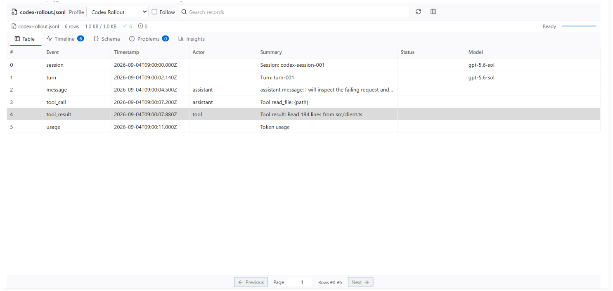
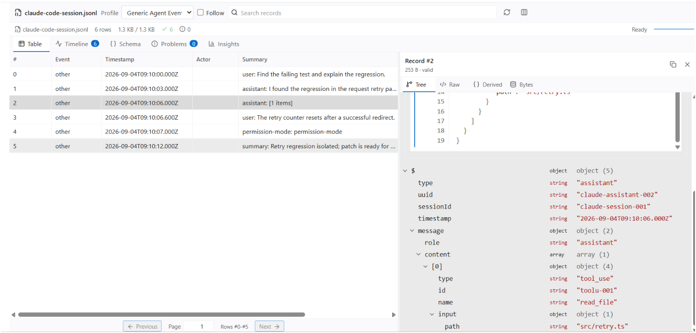
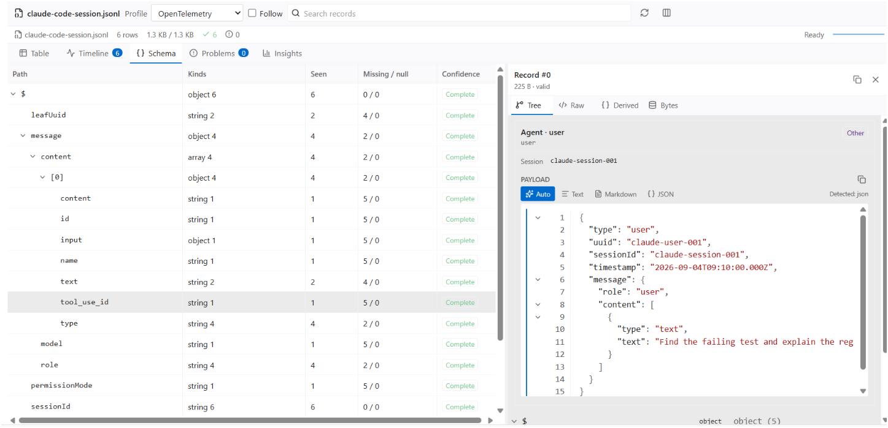
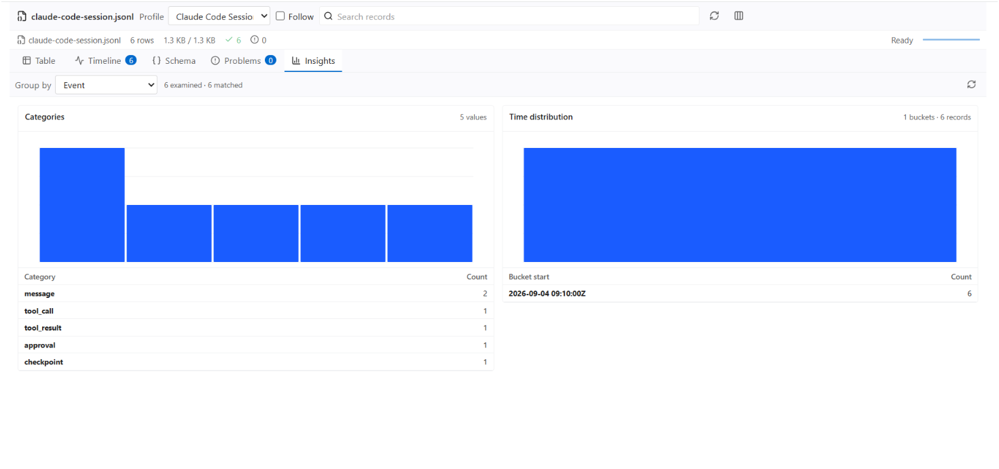

# JsonlView

JsonlView is a read-only VS Code event data studio. Its first format adapter is
a bounded JSONL/NDJSON engine; semantic profiles turn records into useful views
for traditional software logs, telemetry and traces, and Agent trajectories.

It opens `.jsonl` and `.ndjson` as an optional read-only custom editor with:

- bounded byte indexing and lazy record hydration;
- virtualized table, event timeline, schema, problems, and record detail views;
- typed filtering, full-text search, forward/backward cursor pagination, and cancellation;
- direct physical-page input for large files, with BigInt-safe ordinal anchors;
- automatic semantic profile detection without changing the source record;
- collapsible JSON Tree, highlighted Pretty JSON, exact Source, on-demand full event text,
  derived semantics, and Agent content containers with Auto/Text/Markdown/JSON modes,
  and byte-boundary detail views;
- source generation tracking, stale-message rejection, manual rebuild, and follow mode;
- tail follow that keeps the prior page visible until a verified append
  generation can replace it atomically;
- on-demand category and time-bucket Insights with cancellation and hard scan limits.

## Visual examples

These screenshots use the synthetic fixtures maintained in the companion
`JsonlView-harness` checkout. They show the same read-only workbench across
agent events, telemetry, and aggregate analysis.

### Codex Rollout - Table



### Generic Agent Events - Table and Tree



### OpenTelemetry - Schema and Tree



### Claude Code Session - Insights



The source file remains authoritative. JsonlView never edits it, executes its
contents, or sends records over the network. File-backed resources are required
in this release.

## Product boundary

JSONL is the current physical format, while profiles provide the semantic view.
A profile may interpret one JSONL record as an application log, OTel log/span,
request event, Codex/Claude event, or software-engineering Agent step. Profiles
do not own file I/O and cannot rewrite, drop, or split the authoritative record.

Formats that are not line-delimited JSON need separate adapters. Plain or
multiline text logs, a regular JSON array/object, Chrome/Jaeger trace JSON,
OTLP protobuf, and compressed `.jsonl.gz` are not claimed as supported in
v0.2. See `docs/format-and-profile-boundaries.md` and the measured
`docs/acceleration-roadmap.md`.

Built-in semantic profiles currently cover Codex rollout, Claude Code
(transcript, observed job timeline, and observed command-history surfaces),
vendor-neutral Agent events, software-engineering trajectories, OpenTelemetry,
traditional structured application logs, and Generic JSONL fallback. Domain
events keep their identity in the timeline (`log`, `span`, `task`, `action`,
`observation`, `patch`, `test`, and `result`); severity remains a separate
dimension.

Follow mode is opt-in. It opens the current tail page, keeps the visible rows
stable while an appended snapshot is rebuilt, and swaps to the new tail page in
one state update. Replacements, truncation, and invalid prefix changes still
advance the source generation rather than mutating old record references.

Insights is also opt-in: no aggregate scan runs during open. Entering the tab or
pressing its refresh button examines at most 100,000 physical records, 64 MiB of
logical record content, or 5 seconds per request, whichever comes first. Bounded
category/time accumulators receive only matching rows; requests are cancellable
and report examined versus matched records, truncation reason, and group overflow.

Agent message, reasoning, and tool-result text keeps its original value for
copying and can be viewed as plain text, conservative Markdown, or embedded
object/array JSON. Known Codex `item_completed -> AgentMessage -> Text` content,
Claude assistant text blocks, and the explicit Claude job timeline
`at/state/detail/text` shape select Markdown by default; Claude history display,
user prompts, tool output, and ordinary log text retain Auto mode. Structured
tool results are promoted to a foldable JSON container when their value is an
object/array or a bounded double-serialized JSON document. Command output can
also select a conservative Code view for strong Shell, PowerShell, Python,
JavaScript, or Rust signals; uncertain output remains selectable source text.
The Claude surface rules are observed compatibility boundaries, not claims
about an official stable on-disk schema.

Auto recognizes complete JSON, parseable JSON embedded in prose,
headings/lists/quotes/tables, and fenced code; malformed or ambiguous content
stays text. Markdown HTML is never executed. Fenced Python, Shell, JS/TS, Rust,
and SQL snippets receive bounded lexical highlighting, plus per-block copy and
Wrap controls; unknown languages stay exact source. Initial rich parsing is
bounded to 64 KiB and displays its boundary; Raw and Copy remain the routes to
the complete hydrated field without mounting one enormous DOM node. Ordinary
structured results can use a separate bounded expansion up to 256 KiB; larger
values stay Raw-only. Records larger than
`jsonlView.hydration.maxBytes` intentionally remain bounded previews during
list/index hydration. Tree exposes an explicit `Show full record` action for a
second, independently bounded read controlled by
`jsonlView.hydration.fullMaxBytes`; records above that ceiling remain previews.
Visible pages also use the aggregate soft cap
`jsonlView.hydration.pageMaxBytes`; a boundary record may exceed that cap to
preserve cursor progress, and the page banner identifies the partial result.
Rebuild reuses all hydration limits captured when the session opened.

Codex `FileChange` records with `unified_diff` (including path-keyed change
maps) use a bounded unified-diff view with old/new line numbers and explicit
green additions and red removals. Add/delete file content is projected into the
same view; Raw keeps the exact record source, while Copy copies the diff view's
available source.

Codex command arrays use a display-only Shell/PowerShell command view with
argument boundaries, wrapping, and bounded lexical highlighting. Codex Code
Mode JavaScript receives the same treatment for common object literals and
statement boundaries; the original input remains the Copy/Raw source within
the existing record hydration budget.

## Experimental native scanner

`jsonlView.native.newlineScanner` defaults to `off`. `auto` probes the packaged
win32-x64 Rust/napi-rs scanner and keeps it only when a bounded calibration is at
least 10% faster than the adaptive Node scanner; missing, incompatible, or
invalid native output falls back to Node. `on` prefers native but retains the
same validation and fallback. A native process crash cannot be caught by a
JavaScript fallback, which is why native is not the default in v0.2.

```powershell
pnpm benchmark:engine --file <stable.jsonl> --scanner off --no-query
pnpm benchmark:engine --file <stable.jsonl> --scanner auto --no-query
pnpm benchmark:engine --file <stable.jsonl> --scanner on --no-query
```

## Development

Development and CI use Node `24.15.0` through Volta (minimum supported
runtime: Node `22.12.0`) and pnpm `10.26.0`. The Node floor is intentional:
Vitest 5 and the current Node type definitions require it. The VS Code
extension itself remains governed by the `engines.vscode` field above.

Generated benchmark and CDP acceptance artifacts are kept outside the source
workspace by default, under the operating system temporary directory. Set
`JSONLVIEW_ARTIFACT_DIR` to retain them in a specific external directory.

```powershell
pnpm install --frozen-lockfile
pnpm check:contract
pnpm typecheck
pnpm test
pnpm test:coverage
pnpm build
pnpm native:verify
pnpm audit:cargo
pnpm check:cargo-policy
pnpm package:vsix
```

The repository also has a scheduled maintenance lane. `pnpm check:dependencies`
checks direct dependencies against the npm `latest` tag and writes a bounded
JSON report outside the checkout; it reports drift without silently changing the
lockfile. `pnpm benchmark:trend` runs the stable synthetic workload and appends
machine-readable timing and memory samples to an external history file. GitHub
Actions runs both checks weekly and uploads the reports for comparison.

For a pinned producer checkout, `pnpm discover:producers -- --root <checkout>
--out <external-report>` creates a bounded, redaction-safe inventory of JSONL
path literals, serializer/writer terminals, stream producers, and relevant
environment controls. The result is candidate evidence only: it records scan
limits and source revision, may include test/documentation matches, and must be
reviewed against a source anchor and fixture before runtime profile code is
changed. The extension never scans a producer checkout.

Public promotion has a separate read-only gate. `pnpm release:preflight --
--public --approved-npm-name @sumi-labs/jsonl-view
--provenance <full-native-report> --npm-manifest <npm-manifest>
--npm-candidate <candidate-directory> --npm-tarball <exact-tgz>
--vsix-manifest <vsix-manifest>
--vsix-artifact <packaged-vsix> --out <external-report>` requires a clean
checkout, a configured remote, publishable identity and license metadata, a
full native source-to-binary comparison, and inventories that exclude source,
tests, reports, and credentials. The gate re-inspects the exact npm `.tgz`,
including its embedded identity and complete inventory, then re-inspects the
exact VSIX artifact before it can pass.
It never publishes or changes credentials.

After the local and candidate manifests exist, `pnpm promotion:plan --
--preflight <preflight.json> --local-manifest <local-sync.json>
--vsix-manifest <vsix-manifest.json> --npm-manifest <npm-manifest.json>` joins
their identities and provenance into a target-separated, plan-only report. It
requires an explicit window reload readback and leaves GitHub, npm, Open VSX,
and Marketplace in independent authorization states; it never invokes a
publisher or registry command.

Use the exact reviewed VSIX path with `sync:local --vsix <candidate.vsix>` when
the same artifact will be promoted publicly; rebuilding a second candidate can
produce a different native binary digest and is intentionally treated as a new
release candidate.

`pnpm package:npm` creates a reviewable npm candidate directory and one exact
`.tgz` in an external staging area; it never runs `npm publish`. A public
candidate requires an explicit package name, version, `--native`, external
build-once `--dist`, and external `--tarball` paths. Publish only the exact
`.tgz` after preflight; do not rerun `npm publish` on the mutable directory.
Pass the same verified native and production bundle to `package:npm` and
`package:vsix:candidate`; preflight rejects either archive when those shared
bytes differ. `--allow-proprietary` and `--allow-dirty` are limited to local
probe packages; public staging rejects them. Use `--replace` only when
intentionally replacing an existing staging directory. The candidate currently
targets `win32-x64` because it ships the packaged Rust addon.

For the extension currently used on this machine, run the local synchronization
lane with the exact public identity and reviewed version:

```powershell
pnpm sync:local -- --publisher Sumi-Sophia --version 0.2.0 --install
```

The command builds an external VSIX candidate, installs it through the selected
portable VS Code CLI, and verifies the installed id, version, location, and
bundle digests. It records a redaction-safe manifest outside the checkout and
reports that the active window must be reloaded. It never publishes to npm,
GitHub, Open VSX, or Marketplace; those targets use the protected promotion
gate described in [ADR-008](docs/decisions/008-promotion-synchronization.md).

The detailed architecture and acceptance contract live in
[`docs/format-and-profile-boundaries.md`](docs/format-and-profile-boundaries.md)
and the decision records under [`docs/decisions/`](docs/decisions/).

## License

JsonlView is available under the [MIT License](LICENSE.txt). Third-party
licenses and notices are listed in [THIRD-PARTY-NOTICES.txt](THIRD-PARTY-NOTICES.txt).
