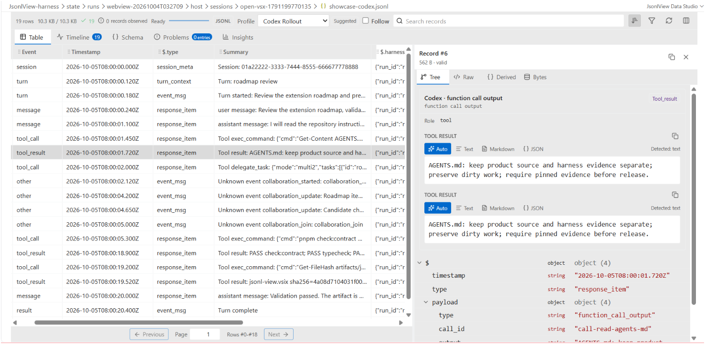
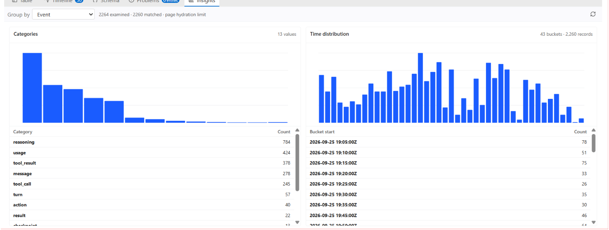
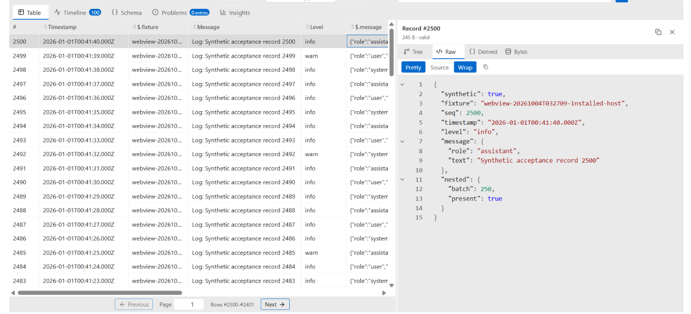
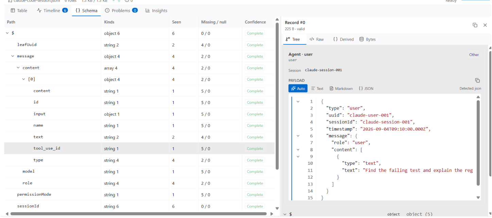
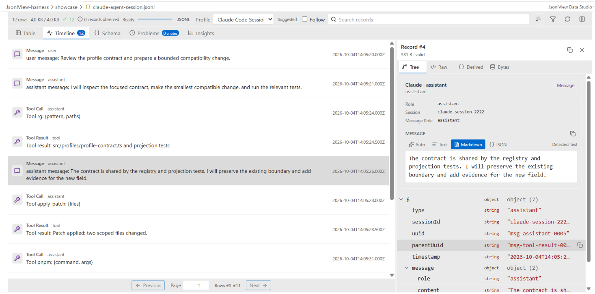
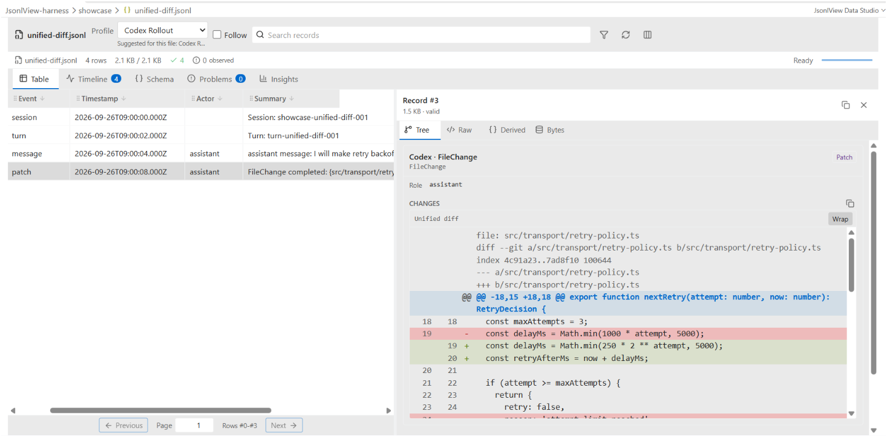

# JsonlView

**A read-only event data studio for VS Code.**

JsonlView turns large JSONL and NDJSON files into a workbench for logs,
telemetry, traces, and coding-agent runs. Browse physical records quickly,
understand their meaning, and inspect the exact source without changing the
file.

## Why JsonlView

JSONL is easy for programs to append and difficult for people to inspect. A
single file can contain thousands of records, malformed lines, tool calls,
trace events, and long agent messages. JsonlView keeps the physical record
authoritative while adding bounded indexing, semantic views, and deliberate
detail loading.

## See It

The same workbench adapts to different event shapes while keeping the source
record available in Raw.

### Agent workflow

### Event analysis

### Record detail

### Telemetry schema

### Claude session timeline

### File changes

## What You Get

- **Fast bounded browsing:** byte-aware indexing, virtualized pages, lazy detail
  hydration, and BigInt-safe ordinals for large files.
- **Views for different questions:** Table, Timeline, Schema, Problems,
  Insights, Tree, Raw, Derived, and Bytes.
- **Useful semantics:** automatic profiles for Codex, Claude Code, pi coding
  agent, OpenTelemetry, structured application logs, software-engineering
  trajectories, and generic JSONL fallback.
- **Safe inspection:** malformed records remain visible, unknown events fall
  back to generic JSON, and the exact source stays available for copying.
- **Focused analysis:** typed filters, text search, physical paging, row-order
  control, bounded category/time Insights, and an opt-in tail Follow mode.
- **Agent session navigation:** an optional read-only tree for supported local
  Codex, Claude, and pi session homes, with parent/child relationships and
  incremental loading.

## Install

Choose one registry build for the VS Code installation.

| Registry | Extension identity |
| --- | --- |
| [Open VSX](https://open-vsx.org/extension/Sumi-Sophia/jsonl-view) | Sumi-Sophia.jsonl-view |
| [Visual Studio Marketplace](https://marketplace.visualstudio.com/items?itemName=Sumi-Sophia.jsonlview-data-studio) | Sumi-Sophia.jsonlview-data-studio |

You can also open the VS Code Extensions view and search for **JsonlView Data
Studio**. The extension requires VS Code 1.136 or newer and file-backed
random access; virtual workspaces are not supported in this release.

## A Real Use Path

1. Open a .jsonl or .ndjson file in VS Code. Use **Open With** when another
   editor is registered for the file type.
2. Start in **Table** to scan records. Switch to **Timeline**, **Schema**, or
   **Problems** when the shape or data quality needs a different view.
3. Select a record to open the detail drawer. Use **Tree** for structure,
   **Raw** for the exact source, **Derived** for bounded semantic fields, and
   **Bytes** for physical offsets.
4. Apply a profile when the automatic suggestion needs confirmation. Profiles
   add labels and fields; they do not rewrite the JSONL record.
5. Enable **Follow** when a producer appends to the file. Use **Insights** only
   when you need bounded aggregate counts or time buckets.
6. Enable **Session Navigator** in settings when you want local agent sessions.
   Standard Codex, Claude, and pi homes can be detected after opt-in; other
   roots can be added explicitly from the Navigator.

## Opt-In Product Lines

The editor is read-only by default. The following surfaces are deliberately
opt-in or disabled by default:

| Surface | Default | What it does |
| --- | --- | --- |
| Profile auto-detection | On | Suggests a semantic view from bounded samples. |
| Follow | Off | Tracks an append-only tail after an explicit action. |
| Insights | On demand | Runs a bounded aggregate scan only when opened or refreshed. |
| Session Navigator | Off | Reads supported local agent metadata after authorization. |
| Native newline scanner | Off | Probes the optional accelerator only when configured. |
| MCP navigation contract | Disabled | Keeps the experimental metadata adapter out of runtime transports. |
| OTLP export | Disabled | Keeps observability export out of the product until separately enabled. |

## Privacy And Source Authority

- JsonlView never edits the source file, executes its contents, or requires a
  network connection to browse it.
- Indexes, session catalog rows, and Webview projections are disposable
  metadata. The source JSONL remains the authority.
- Record hydration is bounded. Raw and Copy preserve the available source
  value when a structured view is incomplete or ambiguous.
- Session Navigator reads local provider metadata only after opt-in and keeps
  transcript bodies out of its catalog.
- MCP and OTLP are disabled experimental boundaries in this release; no
  network listener is created by the default product path.

See [format and profile boundaries](docs/format-and-profile-boundaries.md) for
the exact contract and unsupported formats.

## Supported Boundary

The current physical adapter accepts file-backed .jsonl and .ndjson. It
does not claim regular JSON arrays/objects, multiline text logs, compressed
JSONL, OTLP protobuf, or Chrome/Jaeger trace JSON as drop-in formats. Those
formats need their own framing and authority rules; see the
[format boundary](docs/format-and-profile-boundaries.md).

Semantic profiles are additive. They can identify common Codex, Claude Code,
pi, OpenTelemetry, application-log, and Agent fields, but unknown records stay
available through the generic view. The observed Claude and agent surface
rules are compatibility behavior, not a promise that a producer's private
schema is stable.

## Roadmap Preview

The next architecture work is staged and evidence-led:

- [Runtime-bounded decomposition and toolchain ownership](docs/decisions/035-architecture-decomposition-and-toolchain-ownership.md)
  keeps the extension host, Webview, engine, profiles, and native scanner under
  explicit ownership while preserving the current facade.
- [Architecture evolution slices](docs/decisions/039-architecture-evolution-slices.md)
  proposes barrel export isolation, test colocation, and staged vertical
  migration as small reversible steps.
- [Acceleration roadmap](docs/acceleration-roadmap.md) measures optional native
  scanning and future query work against the portable implementation before
  any capability becomes a default.

These are roadmap decisions and experiments, not promises to mutate source
files, add a network service, or split the product into packages before a
second consumer and release contract justify it.

## Documentation

- [Format and profile boundaries](docs/format-and-profile-boundaries.md)
- [Decision records](docs/decisions/README.md)
- [Release and publication notes](docs/marketplace-publishing.md)
- [Changelog](CHANGELOG.md)

## Development

The repository uses the Node version declared by .node-version and the pnpm
version declared by package.json.

    pnpm install --frozen-lockfile
    pnpm check:contract
    pnpm typecheck
    pnpm test
    pnpm build

## License

JsonlView is available under the [MIT License](LICENSE.txt). Third-party
licenses and notices are listed in [THIRD-PARTY-NOTICES.txt](THIRD-PARTY-NOTICES.txt).
